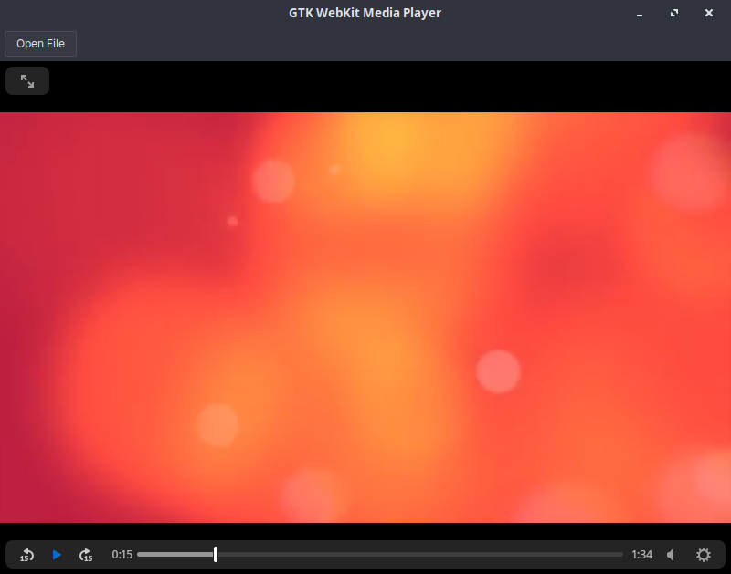

# MPPlayer

MPPlayer is a **simple lightweight media player** written in **C** using **GTK** and **WebKitGTK**.
It allows you to open and play local video files in a minimal GTK interface using HTML5 video playback.



---

## Features

* Open and play local video files
* Autoplay videos in full-window mode
* Simple GTK-based toolbar with **Open File** button
* Minimal, memory-friendly interface
* Uses WebKitGTK for HTML5 video playback

---

## Requirements

* **C compiler** (C11 recommended)
* **GTK 3**
* **WebKitGTK** (`webkit2gtk`)
* `pkg-config`
* Linux system (designed for GTK/WebKitGTK)

---

## Building

1. Clone the repository and enter the project directory:

```bash
git clone https://github.com/yourusername/MPPlayer
cd MPPlayer
```

2. Compile using `gcc` and `pkg-config`:

```bash
gcc main.cpp -o MPPlayer `pkg-config --cflags --libs gtk+-3.0 webkit2gtk-4.0`
```

3. Run the media player:

```bash
./MPPlayer
```

---

## Usage

* Click the **Open File** button in the toolbar
* Select a video file from your system
* The video will play automatically in the window
* Controls are provided directly in the video (play, pause, seek, volume)

---

## Notes

* Only local files are supported
* Videos are displayed using HTML5 `<video>` element
* Autoplay and controls are enabled by default
* Minimal, experimental player mainly intended for learning GTK and WebKitGTK

---

## License

[MIT License](LICENSE)
